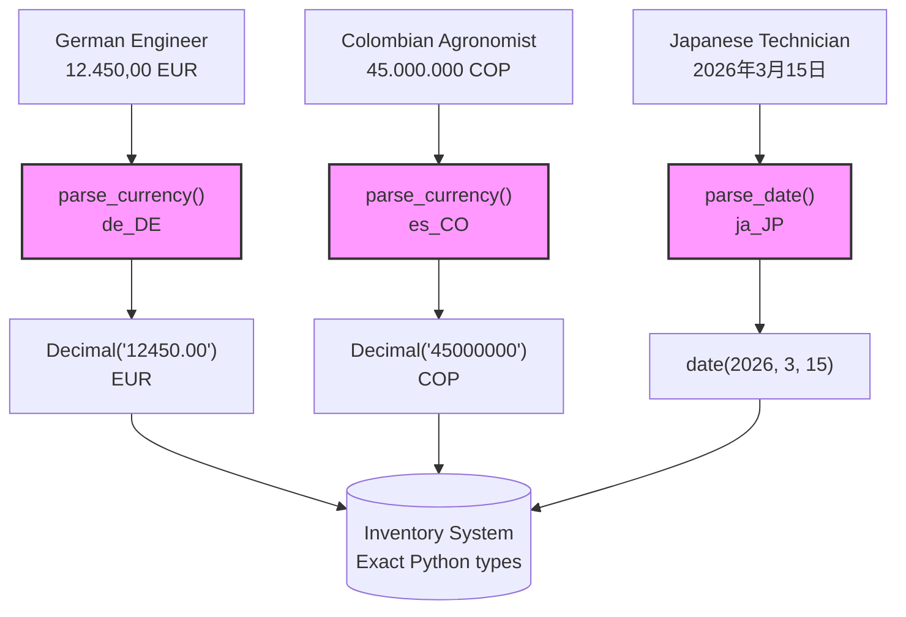

<!--
RETRIEVAL_HINTS:
  keywords: [ftllexengine, fluent, localization, i18n, l10n, ftl, translation, plurals, babel, cldr, python, parsing, numbers, dates, currency, thread-safe, iso, territory, decimal-digits, ftl-spec-runtime, boot-validation, strict-mode, LocalizationBootConfig, require_clean, compliance, audit, regulated, bidirectional, FluentBundle, FluentLocalization, FluentNumber, required_messages, clear_module_caches]
  answers: [what is ftllexengine, how to install, quick start, fluent python, localization library, currency parsing, date parsing, number parsing, thread safety, iso introspection, territory currency, boot validation, production localization, strict mode, require_clean, LocalizationBootConfig, regulated deployments, audit trail, ftl spec runtime, bidirectional parsing, locale-aware formatting]
  related: [docs/QUICK_REFERENCE.md, docs/DOC_00_Index.md, docs/PARSING_GUIDE.md, docs/TERMINOLOGY.md]
-->

[](https://github.com/resoltico/FTLLexEngine)

-----

[](https://pypi.org/project/ftllexengine/)
[](https://pypi.org/project/ftllexengine/)
[](https://codecov.io/github/resoltico/FTLLexEngine)
[](https://opensource.org/licenses/MIT)

-----

# FTLLexEngine

**Python runtime for the Fluent (FTL) specification. Locale-aware numbers, dates, and currency — bidirectional, thread-safe, strict-mode validated, Decimal-precise — in `.ftl` files, not your code.**

## Why FTLLexEngine?

- **Locale-aware numbers, dates, and currency** -- `NUMBER()`, `DATETIME()`, `CURRENCY()` format values per Unicode CLDR for 200+ locales. One function call, correct output everywhere
- **Bidirectional** -- Format data for display *and* parse user input back to exact Python types. `"12.450,00 EUR"` → `(Decimal('12450.00'), 'EUR')`
- **Thread-safe** -- No global state. 100 concurrent requests, zero locale conflicts
- **Strict by default** -- Errors raise exceptions, not silent `{$amount}` fallbacks. Pass `strict=False` for soft error recovery
- **Boot validation** -- `LocalizationBootConfig` validates all resources and message schemas before your application accepts traffic. Fail before the first request, not during it
- **Introspectable** -- Query what variables a message needs before you call it
- **Declarative grammar** -- Plurals, gender, and cases in `.ftl` files. Code stays clean
- **Decimal precision** -- `Decimal` throughout. No float math, no rounding surprises

---

Meet **Alice** and **Bob**.

**Alice** exports specialty coffee. Her invoices ship to buyers in Tokyo, Hamburg, and New York. Three languages, three currency formats, zero tolerance for rounding errors. "1 bag" in English, "1 Sack" in German, "1袋" in Japanese -- and Polish has four plural forms, Arabic has six. She moved grammar rules to `.ftl` files and never looked back.

**Bob** runs supply operations at Mars Colony 1. Personnel from Germany, Japan, and Colombia order provisions in their own locale. A German engineer types `"12.450,00 EUR"`. A Japanese technician enters `"￥1,245,000"`. Bob's system needs exact `Decimal` values from both. One parsing error on a cargo manifest means delayed shipments for 200 colonists.

FTLLexEngine keeps their systems coherent. Built on the [Fluent specification](https://projectfluent.org/) that powers Firefox. 200+ locales via Unicode CLDR. Thread-safe by default.

---

## Quick Start

```python
from ftllexengine import FluentBundle

bundle = FluentBundle("en_US", use_isolating=False)
bundle.add_resource("""
coffee-order = { $bags ->
    [one]   1 bag of { $origin } coffee
   *[other] { $bags } bags of { $origin } coffee
}
""")

result, errors = bundle.format_pattern("coffee-order", {"bags": 500, "origin": "Ethiopian"})
assert errors == ()
assert result == "500 bags of Ethiopian coffee"
```

Unknown locales raise `ValueError` on `FluentBundle`,
`FluentLocalization`, `number_format()`, `datetime_format()`, and
`currency_format()` rather than silently formatting with a fallback locale.

> `use_isolating=False` removes Unicode bidi isolation markers from output, making strings suitable for direct comparison and logging. The default `use_isolating=True` wraps each placeable in U+2068/U+2069 markers for correct bidirectional text rendering in UI contexts.

**Parse user input back to Python types:**

```python
from decimal import Decimal
from ftllexengine.parsing import parse_currency

# German buyer enters a bid price
result, errors = parse_currency("12.450,00 EUR", "de_DE", default_currency="EUR")
if not errors:
    amount, currency = result  # (Decimal('12450.00'), 'EUR')
    assert amount == Decimal("12450.00")
    assert currency == "EUR"
```

---

## Table of Contents

- [Installation](#installation)
- [Multi-Locale Formatting — Alice Ships to Every Port](#multi-locale-formatting--alice-ships-to-every-port)
- [Bidirectional Parsing — Bob Parses Every Input](#bidirectional-parsing--bob-parses-every-input)
- [Thread-Safe Concurrency — 100 Threads, Zero Race Conditions](#thread-safe-concurrency--100-threads-zero-race-conditions)
- [Streaming Resource Loading — Large Files Without Peak Memory](#streaming-resource-loading--large-files-without-peak-memory)
- [Async Applications — Non-Blocking Formatting](#async-applications--non-blocking-formatting)
- [Message Introspection — Pre-Flight Checks](#message-introspection--pre-flight-checks)
- [Production Boot Validation — Systems That Accept Traffic Safely](#production-boot-validation--systems-that-accept-traffic-safely)
- [Currency Data — Operations Across Borders](#currency-data--operations-across-borders)
- [Architecture at a Glance](#architecture-at-a-glance)
- [When to Use FTLLexEngine](#when-to-use-ftllexengine)
- [Documentation](#documentation)
- [Contributing](#contributing)
- [Legal](#legal)

---

## Installation

```bash
uv add ftllexengine[babel]
```

Or with pip:

```bash
pip install ftllexengine[babel]
```

This is the **full runtime** install: locale-aware formatting, localization orchestration,
bidirectional parsing, and Babel-backed ISO helpers.

**Requirements**: Python >= 3.13 | Babel >= 2.18

<details>
<summary>Parser-only installation (no Babel dependency)</summary>

```bash
uv add ftllexengine
```

Or: `pip install ftllexengine`

**Available in parser-only installs:**
- FTL syntax parsing (`parse_ftl()`, `serialize_ftl()`)
- AST manipulation and transformation
- Validation and message introspection
- Zero-dependency runtime helpers such as `CacheConfig`, `FluentNumber`,
  `FunctionRegistry`, `fluent_function`, and `make_fluent_number`
- Zero-dependency localization loading types such as `PathResourceLoader`,
  `FallbackInfo`, `ResourceLoadResult`, and `LoadSummary`
- Embedded ISO 4217 decimal precision lookup via `get_currency_decimal_digits()`

**Requires the full runtime install:**
- `FluentBundle` (locale-aware formatting)
- `AsyncFluentBundle`
- `FluentLocalization` (multi-locale fallback)
- `LocalizationBootConfig`
- Runtime formatter and registry helpers such as `number_format()`,
  `datetime_format()`, `currency_format()`, `select_plural_category()`,
  `create_default_registry()`, and `get_shared_registry()`
- Bidirectional parsing (numbers, dates, currency)
- Localized ISO territory/currency metadata lookups and ISO code validation helpers

Public formatting and localization entry points reject unknown locales
instead of silently falling back to `en_US`.
Parser-only facade probes such as `hasattr(ftllexengine.runtime, "number_format")`
and `getattr(ftllexengine, "FluentBundle", None)` treat Babel-backed names
as absent instead of raising during feature detection.

</details>

---

## Multi-Locale Formatting — Alice Ships to Every Port

Alice's invoices go to Tokyo, Hamburg, and New York. Same data, different languages, different number formats. She maintains one `.ftl` file per locale. Translators edit the files. Her trading platform ships features.

**English (New York buyer):**

```python
from decimal import Decimal
from ftllexengine import FluentBundle

bundle = FluentBundle("en_US", use_isolating=False)
bundle.add_resource("""
shipment-line = { $bags ->
    [0]     No bags shipped
    [one]   1 bag of { $origin } coffee
   *[other] { $bags } bags of { $origin } coffee
}

invoice-total = Total: { CURRENCY($amount, currency: "USD") }
""")

result, _ = bundle.format_pattern("shipment-line", {"bags": 500, "origin": "Colombian"})
assert result == "500 bags of Colombian coffee"

result, _ = bundle.format_pattern("invoice-total", {"amount": Decimal("187500.00")})
assert result == "Total: $187,500.00"
```

**German (Hamburg buyer):**

```python
from decimal import Decimal
from ftllexengine import FluentBundle

bundle_de = FluentBundle("de_DE", use_isolating=False)
bundle_de.add_resource("""
shipment-line = { $bags ->
    [0]     Keine Saecke versandt
    [one]   1 Sack { $origin } Kaffee
   *[other] { $bags } Saecke { $origin } Kaffee
}

invoice-total = Gesamt: { CURRENCY($amount, currency: "EUR") }
""")

result, _ = bundle_de.format_pattern("shipment-line", {"bags": 500, "origin": "kolumbianischer"})
assert result == "500 Saecke kolumbianischer Kaffee"

result, _ = bundle_de.format_pattern("invoice-total", {"amount": Decimal("187500.00")})
assert result == "Gesamt: 187.500,00\u00a0€"  # CLDR: non-breaking space before symbol
```

**Japanese (Tokyo buyer):**

```python
from decimal import Decimal
from ftllexengine import FluentBundle

bundle_ja = FluentBundle("ja_JP", use_isolating=False)
bundle_ja.add_resource("""
shipment-line = { $bags ->
    [0]     出荷なし
   *[other] { $origin }コーヒー { $bags }袋
}

invoice-total = 合計：{ CURRENCY($amount, currency: "JPY") }
""")

result, _ = bundle_ja.format_pattern("shipment-line", {"bags": 500, "origin": "コロンビア"})
assert result == "コロンビアコーヒー 500袋"

result, _ = bundle_ja.format_pattern("invoice-total", {"amount": Decimal("28125000")})
assert result == "合計：￥28,125,000"
```

Bob uses the same pattern at Mars Colony 1. Spanish for the Colombian agronomists? Add one `.ftl` file. Zero code changes.

> In production, translators maintain separate `.ftl` files per locale. Your code loads them with `Path("invoice_de.ftl").read_text()`.

---

## Bidirectional Parsing — Bob Parses Every Input

Most libraries only format outbound data. That's a one-way trip.

Bob's colonists type orders and quantities in their local format. A German engineer enters `"12.450,00 EUR"`. A Colombian agronomist enters `"45.000.000 COP"`. A Japanese technician files a delivery date as `"2026年3月15日"`. FTLLexEngine parses them all to exact Python types.

```python
from decimal import Decimal
from ftllexengine.parsing import (
    parse_currency,
    parse_date,
    parse_decimal,
    parse_fluent_number,
)

# German engineer enters a bid in EUR
bid_result, errors = parse_currency("12.450,00 EUR", "de_DE", default_currency="EUR")
if not errors:
    bid_amount, bid_currency = bid_result  # (Decimal('12450.00'), 'EUR')

# Colombian agronomist enters an ask in COP
ask_result, errors = parse_currency("45.000.000 COP", "es_CO", default_currency="COP")
if not errors:
    ask_amount, ask_currency = ask_result  # (Decimal('45000000'), 'COP')

# Japanese technician enters a delivery date
contract_date, errors = parse_date("2026年3月15日", "ja_JP")
assert not errors
assert contract_date.isoformat() == "2026-03-15"

# German engineer enters a localized amount for use in a Fluent message
fnum, errors = parse_fluent_number("12.450,00", "de_DE")
if not errors:
    # FluentNumber(value=Decimal('12450.00'), formatted='12.450,00', precision=2)
    # Pass fnum directly as a $variable — it carries its formatting metadata
    assert fnum.value == Decimal("12450.00")
    assert str(fnum) == "12.450,00"
```



**When parsing fails, you get structured errors -- not exceptions:**

```python
from ftllexengine.parsing import parse_decimal

price, errors = parse_decimal("twelve thousand", "en_US")
assert price is None
assert errors

if errors:
    err = errors[0]
    print(err)  # "Failed to parse decimal 'twelve thousand' for locale 'en_US': ..."
```

### Decimal Precision

Alice calculates contract values. Float math fails: `0.1 + 0.2 = 0.30000000000000004`.

FTLLexEngine uses `Decimal` throughout:

```python
from decimal import Decimal
from ftllexengine.parsing import parse_currency

price_result, errors = parse_currency("$4.25", "en_US", default_currency="USD")
if not errors:
    price_per_lb, currency = price_result  # (Decimal('4.25'), 'USD')
    assert price_per_lb == Decimal("4.25")
    assert currency == "USD"

    bags = 500
    lbs_per_bag = Decimal("132")  # Standard 60kg bag
    total_lbs = bags * lbs_per_bag
    contract_value = total_lbs * price_per_lb
    # Decimal('280500.00') -- exact, every time
```

### No Silent Failures

> [!NOTE]
> A missing variable returns a fallback string like `"Contract: 500 bags at {!CURRENCY}/lb"`. In financial systems or mission-critical operations, displaying this to a user is unacceptable.

`FluentBundle` defaults to `strict=True`. On any formatting error, FTLLexEngine raises immediately -- no bad data reaches the user.

```python
from decimal import Decimal
from ftllexengine import CacheConfig, FluentBundle, FormattingIntegrityError

# strict=True is the DEFAULT: raises FormattingIntegrityError on ANY formatting error
bundle = FluentBundle("en_US", cache=CacheConfig(), use_isolating=False)
bundle.add_resource('confirm = Contract: { $bags } bags at { CURRENCY($price, currency: "USD") }/lb')

# Works normally when all variables are provided
result, _ = bundle.format_pattern("confirm", {"bags": 500, "price": Decimal("4.25")})
assert result == "Contract: 500 bags at $4.25/lb"

# Missing variable raises immediately (default strict=True behavior)
try:
    bundle.format_pattern("confirm", {"bags": 500})  # forgot $price
except FormattingIntegrityError as e:
    print(f"HALT: {e.message_id} failed")
    # e.fallback_value = "Contract: 500 bags at {!CURRENCY}/lb"
    # e.fluent_errors = (FrozenFluentError(...),)

# For soft error recovery, opt in with strict=False
soft_bundle = FluentBundle("en_US", strict=False, use_isolating=False)
soft_result, soft_errors = soft_bundle.format_pattern("missing-message", {})
assert soft_result == "{missing-message}"  # fallback: key wrapped in braces
assert soft_errors
```

---

## Thread-Safe Concurrency — 100 Threads, Zero Race Conditions

Alice's trading desk gets busy. Bids from Frankfurt, asks from Bogota, confirmations to Tokyo -- concurrent requests, each in a different locale. Bob's colony runs the same pattern: 200 settlers, simultaneous orders, mixed locales.

**The problem:** Python's `locale` module uses global state. Thread A sets German, Thread B reads it, chaos ensues.

**The solution:** FTLLexEngine bundles are isolated. No global state. No locks you manage. No race conditions.

```python
from concurrent.futures import ThreadPoolExecutor
from decimal import Decimal
from ftllexengine import FluentBundle

# Create locale-specific bundles (typically done once at startup)
de_bundle = FluentBundle("de_DE", use_isolating=False)
es_bundle = FluentBundle("es_CO", use_isolating=False)
ja_bundle = FluentBundle("ja_JP", use_isolating=False)

ftl_source = 'confirm = { CURRENCY($amount, currency: "USD") } per { $unit }'
de_bundle.add_resource(ftl_source)
es_bundle.add_resource(ftl_source)
ja_bundle.add_resource(ftl_source)

def format_confirmation(bundle, amount, unit):
    result, _ = bundle.format_pattern("confirm", {"amount": amount, "unit": unit})
    return result

with ThreadPoolExecutor(max_workers=100) as executor:
    futures = [
        executor.submit(format_confirmation, de_bundle, Decimal("4.25"), "lb"),
        executor.submit(format_confirmation, es_bundle, Decimal("4.25"), "lb"),
        executor.submit(format_confirmation, ja_bundle, Decimal("4.25"), "lb"),
    ]
    confirmations = [f.result() for f in futures]
    assert confirmations == ["4,25\u00a0$ per lb", "US$4,25 per lb", "$4.25 per lb"]
    # CLDR locale-specific symbols; de_DE uses non-breaking space before $
```

`FluentBundle` and `FluentLocalization` are thread-safe by design:
- Multiple threads can format messages simultaneously (read lock)
- Adding resources or functions acquires exclusive access (write lock)
- You don't manage any of this -- it just works

---

## Streaming Resource Loading — Large Files Without Peak Memory

Bob's colony manifest system loads `.ftl` files that grow as new message templates accumulate. Loading the entire file into a string before parsing wastes memory on large resources — and for pipelines reading from network streams, full-string loading isn't possible.

`add_resource_stream` and `parse_stream_ftl` accept any line iterator. Memory stays proportional to the largest single FTL entry, not the full file:

```python
from pathlib import Path
from tempfile import TemporaryDirectory
from ftllexengine import FluentBundle, parse_stream_ftl

with TemporaryDirectory() as tmp:
    source_path = Path(tmp) / "colony_messages.ftl"
    source_path.write_text(
        "hello = Hello from orbit\n"
        "status = Cargo ready\n",
        encoding="utf-8",
    )

    bundle = FluentBundle("en_US")
    with source_path.open(encoding="utf-8") as handle:
        junk = bundle.add_resource_stream(handle, source_path=source_path.name)
    assert junk == ()

    with source_path.open(encoding="utf-8") as handle:
        entry_ids = [entry.id.name for entry in parse_stream_ftl(handle)]
    assert entry_ids == ["hello", "status"]
    print(entry_ids)
```

**Same guarantees as `add_resource`:**
- Strict mode: raises `SyntaxIntegrityError` on junk entries (default `strict=True`)
- Thread-safe: entries collected outside the lock, committed atomically
- Soft mode: `add_resource_stream` returns `tuple[Junk, ...]` when `strict=False`

`FluentLocalization.add_resource_stream` works identically for multi-locale setups:

```python
from pathlib import Path
from tempfile import TemporaryDirectory
from ftllexengine import FluentLocalization
from ftllexengine.localization import PathResourceLoader

with TemporaryDirectory() as tmp:
    base = Path(tmp) / "locales"
    (base / "de_de").mkdir(parents=True)
    (base / "en_us").mkdir(parents=True)
    (base / "de_de" / "messages.ftl").write_text("hello = Hallo\n", encoding="utf-8")
    (base / "en_us" / "messages.ftl").write_text("hello = Hello\n", encoding="utf-8")
    extra_path = Path(tmp) / "extra_de.ftl"
    extra_path.write_text("shipment = Zusatzdatei\n", encoding="utf-8")

    loader = PathResourceLoader(str(base / "{locale}"))
    l10n = FluentLocalization(["de_DE", "en_US"], ["messages.ftl"], loader)
    with extra_path.open(encoding="utf-8") as handle:
        l10n.add_resource_stream("de_DE", handle, source_path=extra_path.name)

    shipment, errors = l10n.format_value("shipment")
    assert errors == ()
    assert shipment == "Zusatzdatei"
```

---

## Async Applications — Non-Blocking Formatting

Alice's trading platform runs on asyncio. `FluentBundle` is thread-safe, but calling it from an async handler blocks the event loop for the duration of each format call. `AsyncFluentBundle` eliminates this: every mutation and formatting operation runs in a thread pool via `asyncio.to_thread()`, leaving the event loop free.

```python
import asyncio
from ftllexengine import AsyncFluentBundle

async def handle_request(name: str, bags: int) -> str:
    async with AsyncFluentBundle("en_US", use_isolating=False) as bundle:
        await bundle.add_resource("""
coffee-order = { $bags ->
    [one]   1 bag for { $name }
   *[other] { $bags } bags for { $name }
}
""")
        result, _ = await bundle.format_pattern(
            "coffee-order", {"name": name, "bags": bags}
        )
        return result

assert asyncio.run(handle_request("Alice", 2)) == "2 bags for Alice"

# Shared bundle across requests (create once, reuse):
_bundle = AsyncFluentBundle("en_US")

async def startup() -> None:
    with open("messages.ftl", encoding="utf-8") as f:
        await _bundle.add_resource_stream(f, source_path="messages.ftl")
```

**Same strict-mode guarantees as `FluentBundle`:**
- `strict=True` (default): raises `FormattingIntegrityError` on any resolution error
- Fast read operations (`has_message`, `get_message`, `introspect_message`) remain synchronous — O(1) dict lookups too short to block the event loop

---

## Message Introspection — Pre-Flight Checks

Bob's systems generate cargo manifests. Before calling `format_pattern()`, they verify: *what variables does this message require? Are all of them available?*

Alice's compliance team uses the same introspection to catch missing variables at build time, not during live operations.

```python
from ftllexengine import FluentBundle

bundle = FluentBundle("en_US", use_isolating=False)
bundle.add_resource("""
contract = { $buyer } purchases { $bags ->
        [one] 1 bag
       *[other] { $bags } bags
    } of { $grade } coffee from { $seller } at { CURRENCY($price, currency: "USD") }/lb.
    Shipment: { $port } by { DATETIME($ship_date) }.
""")

info = bundle.introspect_message("contract")

assert info.get_variable_names() == frozenset(
    {"buyer", "bags", "grade", "seller", "price", "port", "ship_date"}
)
assert info.get_function_names() == frozenset({"CURRENCY", "DATETIME"})
assert info.has_selectors is True
assert info.requires_variable("price") is True
```

**Use cases:**
- Verify all required data before generating manifests or confirmations
- Auto-generate input fields from message templates
- Catch missing variables at build time, not during live operations

---

## Production Boot Validation — Systems That Accept Traffic Safely

Alice's trading platform and Bob's colony manifest system can't discover a bad `.ftl` file mid-operation. They validate everything at startup.

`LocalizationBootConfig` is the production boot sequence: load all resources, run `require_clean()` to assert every locale loaded without errors, and validate all message schemas before the first request arrives. If anything is wrong, it raises before traffic starts -- not during it. Each config instance is single-use, so create a new one for each boot attempt.

```python
from pathlib import Path
from tempfile import TemporaryDirectory
from ftllexengine import LocalizationBootConfig

with TemporaryDirectory() as tmp:
    base = Path(tmp) / "locales"
    for locale, invoice_label in {
        "en_us": "Total",
        "de_de": "Gesamt",
        "ja_jp": "合計",
    }.items():
        locale_dir = base / locale
        locale_dir.mkdir(parents=True)
        (locale_dir / "invoice.ftl").write_text(
            f'invoice-total = {invoice_label}: {{ CURRENCY($amount, currency: "USD") }}\n',
            encoding="utf-8",
        )
        (locale_dir / "shipment.ftl").write_text(
            'shipment-line = { $bags } bags of { $origin }\n',
            encoding="utf-8",
        )

    cfg = LocalizationBootConfig.from_path(
        locales=("en_US", "de_DE", "ja_JP"),
        resource_ids=("invoice.ftl", "shipment.ftl"),
        base_path=base / "{locale}",
        message_schemas={
            "invoice-total": {"amount"},
            "shipment-line": {"bags", "origin"},
        },
        required_messages=frozenset({"invoice-total", "shipment-line"}),
    )

    l10n, summary, schema_results = cfg.boot()
    print(f"Loaded {summary.total_attempted} resources, {summary.errors} errors")
    assert len(schema_results) == 2
```

**When only the localization object is needed:**

```python
from pathlib import Path
from tempfile import TemporaryDirectory
from ftllexengine import LocalizationBootConfig

with TemporaryDirectory() as tmp:
    base = Path(tmp) / "locales"
    (base / "en_us").mkdir(parents=True)
    (base / "en_us" / "main.ftl").write_text("ready = System ready\n", encoding="utf-8")

    cfg = LocalizationBootConfig.from_path(
        locales=("en_US",),
        resource_ids=("main.ftl",),
        base_path=base / "{locale}",
        required_messages=frozenset({"ready"}),
    )

    l10n = cfg.boot_simple()
    result, errors = l10n.format_value("ready")
    assert errors == ()
    print(result)
```

**Use cases:**
- Regulated systems that must prove clean boot before accepting requests
- Container health checks: boot validation as the readiness probe
- CI pipelines: fail the build if any `.ftl` file has junk or schema drift

---

## Currency Data — Operations Across Borders

Alice sources beans from Colombia, Ethiopia, and Brazil. She sells to importers in Japan, Germany, and the US. Each country uses different currencies with different decimal places.

```python
from ftllexengine.introspection.iso import get_territory_currencies, get_currency

# New buyer in Japan -- what currency?
currencies = get_territory_currencies("JP")
assert currencies == ("JPY",)

# How many decimal places for yen?
jpy = get_currency("JPY")
assert jpy is not None
assert jpy.decimal_digits == 0  # no decimal places for yen

# Compare to Colombian peso
cop = get_currency("COP")
assert cop is not None
assert cop.decimal_digits == 2

# Multi-currency territories
panama_currencies = get_territory_currencies("PA")
assert panama_currencies == ("PAB", "USD")  # Panama uses both Balboa and US Dollar
```

Alice's invoices format correctly: JPY 28,125,000 in Tokyo, $187,500.00 in New York.

---

## Architecture at a Glance

| Component | What It Does | Install Mode |
|:----------|:-------------|:-------------|
| **Syntax** — `ftllexengine.syntax` | FTL parser, AST, serializer, visitor pattern | Parser-only install |
| **Runtime** — `ftllexengine.runtime` | `FluentBundle`, message resolution, thread-safe formatting, built-in functions (`NUMBER`, `CURRENCY`, `DATETIME`), plus zero-dependency helper types | Mixed: parser-only helpers + full-runtime formatters |
| **Localization** — `ftllexengine.localization` | `FluentLocalization` multi-locale fallback chains; `LocalizationBootConfig` strict-mode production boot; zero-dependency loading types | Mixed: parser-only loading types + full-runtime orchestration |
| **Parsing** — `ftllexengine.parsing` | Bidirectional parsing: numbers, dates, currency back to Python types | Full runtime install |
| **Introspection** — `ftllexengine.introspection` | Message-variable/function extraction, AST reference analysis, and ISO helpers; localized territory/currency metadata needs the full runtime while `get_currency_decimal_digits()` uses embedded tables | Mixed: parser-only helpers + full-runtime localized metadata |
| **Analysis** — `ftllexengine.analysis` | Dependency-graph helpers such as `detect_cycles()` | Parser-only install |
| **Validation** — `ftllexengine.validation` | Resource validation, unresolved-reference checks, semantic checks | Parser-only install |
| **Diagnostics** — `ftllexengine.diagnostics` | Structured error types, error codes, formatting | Parser-only install |
| **Integrity** — `ftllexengine.integrity` | BLAKE2b checksums, strict mode, immutable exceptions | Parser-only install |

---

## When to Use FTLLexEngine

### Use It When:

| Scenario | Why FTLLexEngine |
| :--- | :--- |
| **Regulated / audited deployments** | Boot validation raises before traffic starts. Immutable structured errors for audit trails. |
| **Locale-aware numbers, dates, currency** | CLDR-backed `NUMBER()`, `DATETIME()`, `CURRENCY()` for 200+ locales. Correct by spec, not by approximation. |
| **Parsing user input** | Errors as data, not exceptions. Show helpful feedback. |
| **Financial calculations** | `Decimal` precision throughout. Strict mode on every bundle. |
| **Concurrent systems** | Thread-safe. No global locale state. |
| **Complex plurals** | Polish has 4 forms. Arabic has 6. Handle them declaratively. |
| **Multi-locale apps** | 200+ locales. CLDR-compliant. |
| **Multi-currency operations** | ISO 4217 data. Territory-to-currency mapping. Correct decimal places. |
| **AI integrations** | Introspect messages before formatting. |
| **Content/code separation** | Translators edit `.ftl` files. Developers ship code. |

### Use Something Simpler When:

| Scenario | Why Skip It |
| :--- | :--- |
| **Single locale, no user input** | `f"{value:,.2f}"` is enough |
| **No grammar logic** | No plurals, no conditionals |
| **Zero dependencies required** | You need pure stdlib |

---

## Documentation

| Resource | Description |
|:---------|:------------|
| [Quick Reference](docs/QUICK_REFERENCE.md) | Copy-paste patterns for common tasks |
| [API Reference](docs/DOC_00_Index.md) | Reference coverage for the exported package and module APIs |
| [Parsing Guide](docs/PARSING_GUIDE.md) | Bidirectional parsing deep-dive |
| [Data Integrity](docs/DATA_INTEGRITY_ARCHITECTURE.md) | Strict mode, checksums, immutable errors |
| [Terminology](docs/TERMINOLOGY.md) | Fluent and FTLLexEngine concepts |
| [Release Protocol](docs/RELEASE_PROTOCOL.md) | `gh`-first release-branch, tag, GitHub Release, and PyPI procedure |
| [Examples](examples/) | Working code you can run |

---

## Contributing

Contributions welcome. See [CONTRIBUTING.md](CONTRIBUTING.md) for setup and guidelines.
The shortest full-repo verification path is `./check.sh`.

---

## Legal

ftllexengine is MIT-licensed. It has no required runtime dependencies. The optional
[babel] extra adds Babel (BSD 3-Clause). ftllexengine is an independent implementation
of the [FTL Syntax Specification](https://github.com/projectfluent/fluent/blob/master/spec/fluent.ebnf)
(Apache 2.0, Mozilla Foundation and others) and is not affiliated with or endorsed
by Mozilla. See [NOTICE](NOTICE) for attribution and [PATENTS.md](PATENTS.md) for
patent considerations.

[LICENSE](LICENSE) | [NOTICE](NOTICE) | [PATENTS.md](PATENTS.md)
